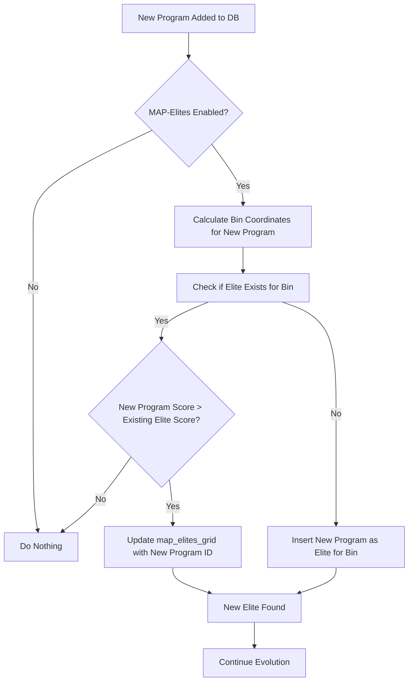

# Detailed Plan: Evolutionary Algorithm Mechanics in Mini-Evolve

**Goal:** To explain the mechanics of the evolutionary algorithm implemented in Mini-Evolve, with a focus on how programs are generated, evaluated, selected, and stored, particularly highlighting the roles of selection and MAP-Elites.

---

## I. Overall Evolutionary Loop (`app/evolution_loop.py`)

The `evolution_loop.py` orchestrates the entire process. It runs for a specified number of generations, iteratively improving the population of programs.

```mermaid
graph TD
    A[Start Evolution] --> B{Initialize DB & Load Seed Program};
    B --> C{For each Generation};
    C --> D[Select Parents];
    D --> E[Generate Children (LLM)];
    E --> F[Evaluate Children];
    F --> G{Self-Correction Loop?};
    G -- Yes --> E;
    G -- No --> H[Add Valid Children to DB];
    H --> I{Update MAP-Elites Grid?};
    I --> J[Check Target Metric];
    J -- Not Met --> C;
    J -- Met --> K[End Evolution];
```

---

## II. Program Database (`app/program_db.py`)

The `program_db.py` module is the backbone for storing and managing programs. It uses SQLite and ensures uniqueness and supports behavioral descriptors for MAP-Elites.

*   **Schema**: The `programs` table stores:
    *   `program_id`: Unique identifier (UUID).
    *   `code_string`: The actual Python code.
    *   `normalized_code_string`: Code after AST normalization (removes formatting differences).
    *   `normalized_code_hash`: SHA256 hash of normalized code (ensures functional uniqueness).
    *   `score`: Evaluation score.
    *   `is_valid`: Boolean indicating if the program is valid.
    *   `generation_discovered`: Generation number when the program was created.
    *   `parent_id`: Link to the parent program.
    *   `llm_prompt`: The prompt used to generate the program.
    *   `evaluation_results_json`: Full evaluation results (JSON).
    *   `descriptor_1`, `descriptor_2`: Behavioral descriptors (e.g., code length, number of function calls).
    *   `timestamp_added`: When the program was added.

*   **Code Normalization & Hashing**:
    *   `normalize_code(code_string)`: Uses `ast.parse` and `ast.unparse` to standardize code formatting, ensuring that functionally identical code (e.g., with different whitespace) has the same normalized form.
    *   `get_code_hash(normalized_code)`: Generates a SHA256 hash of the normalized code. This hash is used to prevent adding duplicate programs to the database.

*   **MAP-Elites Grid (`map_elites_grid` table)**:
    *   `descriptor_1_bin`, `descriptor_2_bin`: Integer coordinates representing a bin in the behavioral descriptor space.
    *   `program_id`: The ID of the "elite" program for that specific bin (the program with the highest score in that bin).
    *   This table ensures that for each unique combination of behavioral characteristics (bins), only the best-performing program is retained, promoting diversity across the population.

---

## III. Behavioral Descriptors (`app/evaluator.py` & `app/program_db.py`)

Behavioral descriptors are crucial for MAP-Elites. They characterize the "behavior" or "style" of a program, allowing the system to maintain a diverse population of solutions.

*   **Extraction (`app/evaluator.py`)**: The `_analyze_python_code` function extracts:
    *   `code_length`: Number of lines of code.
    *   `num_function_calls`: Number of function calls (using `ast.walk`).
    These are stored as `descriptor_1` and `descriptor_2` in the `programs` table.

*   **Binning (`app/program_db.py`)**: The `_get_bin_coordinates` function maps the continuous behavioral descriptor values (e.g., code length, function calls) into discrete bins based on `map_elites.grid_resolution` from `config.yaml`. This allows programs with similar behaviors to be grouped.

---

## IV. Selection Mechanism (`app/selection.py`)

The `select_parents` function determines which programs from the database will serve as parents for the next generation.

```mermaid
graph TD
    A[Start Parent Selection] --> B{MAP-Elites Enabled?};
    B -- Yes --> C[Fetch Valid Elites from map_elites_grid];
    B -- No --> D[Fetch Top K Unique Valid Programs by Score];
    D --> E{Candidate Pool Empty?};
    E -- Yes --> F[Fetch Top K Unique Programs (including invalid)];
    F --> G{Candidate Pool Still Empty?};
    G -- Yes --> H[No Parents Found - Return Empty List];
    G -- No --> I[Randomly Select N Parents from Candidate Pool];
    C --> I;
    I --> J[Return Selected Parents];
```

*   **MAP-Elites Selection (if enabled)**:
    *   It queries the `map_elites_grid` table to get the `program_id` of the elite programs for each bin.
    *   It then retrieves the full program data for these elites from the `programs` table, considering only valid ones.
    *   This ensures that parents are selected from a diverse set of high-performing programs across the behavioral space.

*   **Fallback (if MAP-Elites not enabled or fails)**:
    *   It uses `program_db.get_unique_programs_from_top_k` to get a pool of high-quality, unique, *valid* programs based on their score.
    *   If no valid programs are found, it falls back to selecting from *all* programs (including invalid ones) to prevent the evolution from stalling. This is a crucial robustness feature.

*   **Random Sampling**: From the resulting candidate pool (either from MAP-Elites or score-based), `random.sample` is used to select the `num_parents` for the next generation.

---

## V. MAP-Elites in Action (`app/program_db.py`)

The `add_program_to_map_elites` function is called after a new program is evaluated and added to the `programs` table.



*   When a new program is added to the database, its behavioral descriptors are used to determine its bin coordinates.
*   The system then checks if an "elite" (best-performing program) already exists for that bin in the `map_elites_grid`.
*   If an elite exists, the new program's score is compared to the existing elite's score. If the new program is better, it replaces the old elite in that bin.
*   If no elite exists for the bin, the new program becomes the elite for that bin.

This mechanism ensures that the `map_elites_grid` always contains the best-performing program for each explored behavioral niche, promoting both performance and diversity in the overall population.

---

## VI. Summary of Evolutionary Mechanics

The Mini-Evolve system implements a sophisticated evolutionary algorithm by:

1.  **Generating** new code variants using an LLM, potentially leveraging hierarchical decomposition and self-correction.
2.  **Evaluating** these variants using problem-specific logic, extracting a score and behavioral descriptors.
3.  **Storing** all programs in a database, ensuring uniqueness through code normalization and hashing.
4.  **Maintaining Diversity** and performance through the MAP-Elites algorithm, which populates a grid based on behavioral descriptors and keeps only the best program for each "niche."
5.  **Selecting Parents** for the next generation either directly from the diverse MAP-Elites grid or by prioritizing high-scoring unique programs, with robust fallbacks to ensure continuous evolution.

This iterative process of generation, evaluation, storage, and selection drives the system towards discovering increasingly better and more diverse solutions to the given problem.